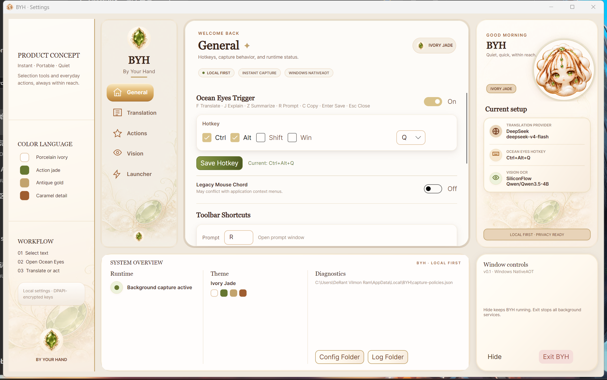
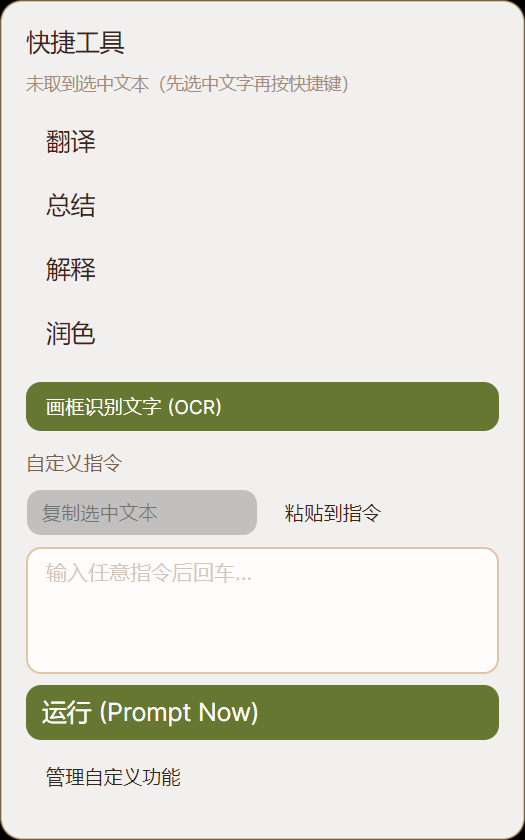

# BYH — By Your Hand

> Context-aware selection assistant. 选词即用，不离开当前上下文。
>
> Status: **v0.1.0** · NativeAOT single-binary · Windows 10+（macOS 移植中） · .NET 10 · [MIT License](#license)

BYH 在后台常驻，通过全局快捷键直达屏幕上当前选中或框选的内容——OCR 识别、即时翻译、剪贴板历史、启动器、提示词模板。所有配置和用户数据落在系统配置目录（Windows: `%LOCALAPPDATA%\BYH\`，macOS: `~/Library/Application Support/BYH/`），密钥走系统级加密（Windows DPAPI / macOS Keychain），不上传任何第三方服务（除非你主动调用 LLM provider）。

> **跨平台路线图**：Windows 完整可用；macOS 移植进行中。架构上有干净的平台抽象层（`Platform.Abstractions`），macOS 端只需新建 `Platform.Mac` 项目填充实现，见 [docs/git-workflow.md](docs/git-workflow.md)。

<table>
  <tr>
    <td width="33%" align="center"><b>设置面板（Ivory Jade 主题）</b><br></td>
    <td width="33%" align="center"><b>Ocean Eyes 区域截图</b><br></td>
    <td width="33%" align="center"><b>选词工具栏</b><br></td>
  </tr>
</table>

---

## 这个版本能做什么（v0.1.0）

| 模块 | 触发 | 说明 |
|---|---|---|
| **Ocean Eyes**（区域截图 OCR） | `Ctrl+Alt+Q` | 拖框选屏幕区域，截图 → OCR → 可选标注/翻译/识别。截图自动写入配置目录，支持贴图、UIA 辅助预填。 |
| **Spotlight 启动器** | `Ctrl+Alt+Space` | 全局快速搜索面板，可启动配置的应用/网页/命令。 |
| **剪贴板历史** | `Ctrl+Alt+V` | 本地历史弹窗，支持文本/图片、自动分类、手动归类、置顶、标签、自定义 tab、全文搜索、月度归档、敏感条目 DPAPI 掩码。 |
| **工具栏**（选中文字后） | 自动浮出 | 选词后弹出，按配置的快捷键执行翻译 / 总结 / 解释 / 自定义提示词。 |
| **托盘菜单** | 右键托盘图标 | 打开设置 / 打开配置目录 / 打开截图画廊 / 重启 / 退出。 |

> 三组主快捷键均可在 **设置 → 各模块页** 自定义（支持 Ctrl/Alt/Shift/Win 修饰键 + A–Z / 0–9 / F1–F12 / Space）。修改后保存即时生效。

---

## 安装与首次启动

1. 把发布包解压到任意目录（例如 `C:\Tools\BYH\`）。
2. 双击 `BYH.exe`。首次启动会在 `%LOCALAPPDATA%\BYH\` 建好配置目录与子目录。
3. 托盘出现 BYH 图标 = 运行中。所有快捷键即刻可用，但 **OCR / 翻译需要先在设置里配 provider**（见下）。

**单实例**：进程级 mutex `Global\BYH_ByYourHand_SingleInstance` 保证同一时间只有一个 BYH 在跑。想替换 exe 时必须先关掉运行的实例（托盘 → 退出，或任务管理器结束 `BYH.exe`）。

**开机自启**：v0.1.0 暂未内置，可手动把 `BYH.exe` 的快捷方式放进 `shell:startup`（资源管理器地址栏输入即可打开启动文件夹）。

---

## 配置 LLM provider（翻译 / OCR / 提示词必需）

打开 **设置 → Translation**（翻译服务）：

- **Name**：任意标识，如 `siliconflow`
- **Base URL**：OpenAI 兼容端点，如 `https://api.siliconflow.cn/v1`
- **API Key**：你的密钥。保存时用 DPAPI 加密落盘到 `%LOCALAPPDATA%\BYH\secrets\`，从不出现在日志或 URL 里
- **Model**：默认模型 id，如 `gpt-4o-mini`（翻译）或 OCR 多模态模型如 `nex-agi/Nex-N2-Pro`

OCR（Ocean Eyes）用哪个 provider/model 在 **设置 → Vision** 单独配（可和翻译用不同的）。

---

## 配置文件清单

全部位于 `%LOCALAPPDATA%\BYH\`：

| 文件 | 作用 |
|---|---|
| `ui-language.json` | UI 语言（`en` / `zh-CN`）。缺失则按系统语言自动检测。切换需重启。 |
| `profile.json` | 显示名（用于问候语）。 |
| `providers.json` | 翻译/LLM provider 列表。 |
| `vision.json` | OCR provider / model / prompt 配置。 |
| `prompt-templates.json` | 工具栏提示词模板（翻译/总结/解释/自定义）。缺失用内置默认。 |
| `ocean-eyes.json` | Ocean Eyes 触发快捷键 + 鼠标和弦开关。 |
| `ocean-eyes-capture.json` | 截图保存路径 / 自动保存 / 写入剪贴板 / UIA 辅助开关。 |
| `spotlight-trigger.json` | 启动器面板快捷键 + 窗口尺寸。 |
| `clipboard-history-trigger.json` | 剪贴板历史弹窗快捷键。 |
| `clipboard-history-settings.json` | 剪贴板功能开关 / 自动粘贴 / 最大条数 / 排除应用 / 敏感掩码。 |
| `clipboard-history.json` | 剪贴板条目（文本）。schema v5。 |
| `clipboard-history-tags.json` | 标签 + 条目→标签分配。 |
| `clipboard-history-icons.json` | 用户导入的图标库（SVG path data）。 |
| `launcher-entries.json` | 启动器条目（用户添加的 app/URL）。 |
| `toolbar-shortcuts.json` | 工具栏内置快捷键（默认 R/C/V）。 |
| `capture-policies.json` | 截图捕获策略。 |
| `clipboard-images/` | 图片剪贴板条目的 PNG。 |
| `clipboard-archive/` | 按月分片（`YYYY-MM.json`）的剪贴板归档。 |
| `launcher-icons/` | 启动器图标缓存。 |
| `secrets/` | DPAPI 加密的 provider 密钥。 |
| `logs/BYH.log` | 运行日志（含 API key 脱敏），按 1MB 滚动保留 5 份。 |

> 配置 JSON 全部手写 reader/writer（NativeAOT 安全，无反射）。删除某个文件即恢复默认。

---

## 设置页结构（左侧导航）

```
Dashboard     ← 模块/事件/模型路由总览（本地脱敏日志驱动）
General       ← 语言、显示名（问候语）
Translation   ← provider 管理 + 测试连通
Actions       ← 工具栏提示词模板
Vision        ← OCR provider / model / UIA 辅助
Launcher      ← 启动器条目
Clipboard     ← 剪贴板历史所有开关与上限
```

设置改动即时保存到对应 JSON；语言切换需重启生效。

---

## 构建

需要 **.NET 10 SDK**。Windows 完整可用；macOS 端 Core/Providers/UI 项目可编译，Windows 项目（`Platform.Windows`）在 macOS 上预期失败，待平台抽象层重构后解决。

```bash
# 编译检查（Windows）
dotnet build SelectionAssistant.slnx -c Release

# 测试（约 661 项，含 i18n 三向同步守卫；Windows.IntegrationTests 仅 Windows 可跑）
dotnet test

# NativeAOT 单文件发布（Windows，生成 BYH.exe，约 28MB）
dotnet publish src/SelectionAssistant.App/SelectionAssistant.App.csproj \
  -c Release -r win-x64
```

**产物不进 git**——编译产物在 `bin/.../publish/BYH.exe`，直接运行即可。对外分发走 [GitHub Releases](https://github.com/CaelumSea/BYH/releases)，用户从 Releases 页下载现成 exe，不必自己编译。

---

## i18n（国际化）

代码内手写字典（NativeAOT / trim-safe，非 resx）：

- `src/SelectionAssistant.Core/I18n/Strings.cs` — 属性入口（`Strings.X`）
- `src/SelectionAssistant.Core/I18n/Strings_en.cs` — 英文值
- `src/SelectionAssistant.Core/I18n/Strings_zh_CN.cs` — 中文值

三处 key 必须 1:1 对齐，由 `StringsTests` 三个不变量测试守卫（CI 红 = key 缺失 / typo / en-zh 不一致）。AXAML 用 `{x:Static i18n:Strings.X}`，code-behind 用 `Strings.X`。

---

## 项目结构

```
src/
├── SelectionAssistant.App/             ← 组合根：Program / App / 托盘 / 接线
├── SelectionAssistant.Core/            ← 领域模型、设置 record、i18n、输入触发器
├── SelectionAssistant.Infrastructure/  ← 配置 store、日志、JSON 序列化
├── SelectionAssistant.Platform.Abstractions/  ← 平台抽象接口（Windows + macOS 共用）
├── SelectionAssistant.Platform.Windows/       ← Win32 P/Invoke、hook、UIA、GDI、托盘
├── SelectionAssistant.Providers/      ← OpenAI 兼容翻译 / OCR client
└── SelectionAssistant.UI/             ← Avalonia 窗口、主题（Ivory Jade）、设置页
```

> macOS 移植会新增 `SelectionAssistant.Platform.Mac`（CoreGraphics / AppKit / Keychain 实现 `Platform.Abstractions` 接口）。

测试：`tests/SelectionAssistant.Core.Tests` / `.Providers` / `.Windows.IntegrationTests`。

---

## 已知限制与下一步

详见 `docs/AUDIT-findings.md` 和 `docs/BACKLOG-roadmap.md`。v0.1.0 之后排期中的硬骨头：

- **M1/M2**：`ClipboardHistoryWindow.axaml.cs`（~2940 行）和 `App.axaml.cs`（~2240 行）的 god-class 拆分
- **L3**：无障碍 `AutomationProperties.Name` 全层补齐（需屏幕阅读器验证）
- **M4**：剩余 ~46 处 `[DllImport]` → `[LibraryImport]` 迁移（hook / launcher / icon 高风险核心路径）
- **L8**：`IManagedWindow` 公共接口（与 M1/M2 耦合）
- 开机自启、安装包

---

## 路线图与审查

`docs/BACKLOG-roadmap.md` 是 R1–R54 路线图待办（含 120 批次演进历史），`docs/AUDIT-findings.md` 是按 P0/P1/P2/P3 分级的全代码库审查清单与修复进度。机器 agent 接续工作时先读根目录 `AGENTS.md`。

---

## License

[MIT](LICENSE) © Caelum
